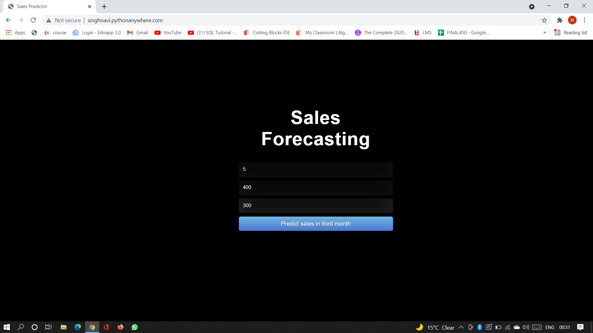
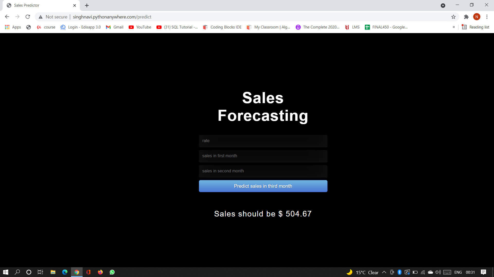
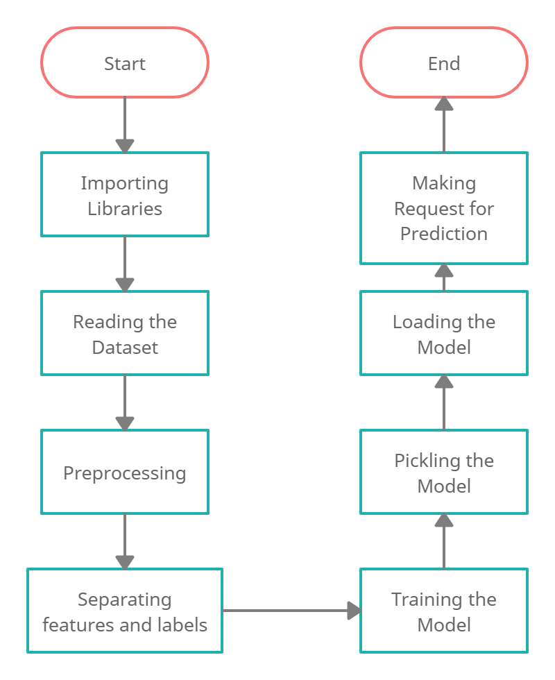

## UCS757 Building Innovative Systems
## Project 3
# Sales Predictor
Here our objective is to predict the further sales

### Following are the steps I followed 
1. Importing the libraries required.
2. Making a Simple Dataset
3. Visualizing the data
4. Using Linear Regression Model
5. Saving the Model
6. Loading the Model
7. Predicting the Model

### Input Image                                                                       
 

### Output Image
 

### Live Link
http://singhnavi.pythonanywhere.com/

### Flowchart
 

## Submitted by :- 
### Navpreet Singh Kapoor
### 101803293
### COE14
